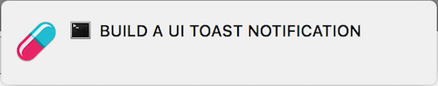

> Don't take the 🔴 red pill down some rabbit hole, the 🔵 blue pill will keep you focused.

# Problem
Staying focused on a single task.

# Solution
Be reminded of the task via desktop notification and alert sound on an interval.

# Example
You've been tasked to build a UI toast notification only to find yourself down some rabbit hole researching server architecture... Happens to all of us.

# Installation
```shell
npm install -g blue-pill
```

# Usage
From your terminal, input `bp` to start the interactive task builder:
```shell
$ bp
✔ Task description … Build a UI toast notification
✔ Reminder interval › 10 Minutes
✔ Alert sound › Winking Face
```



> This will remind you to `Build a UI toast notification` via desktop notification and alert sound every 10 minutes.
